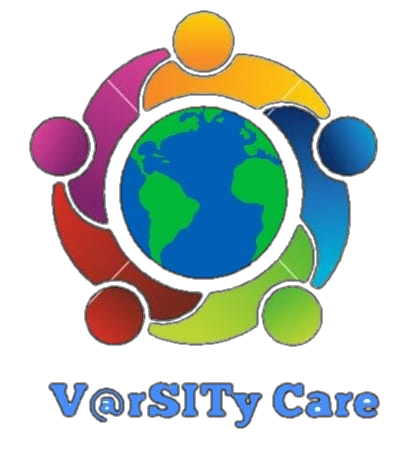

&nbsp;

<h1 align="center"> VarSITy Care</h1>

&nbsp;

#### **This is the official repo of the Website of VarSITy Care.**

&nbsp;

V@rSITy Care, the social awareness club at **Symbiosis Institute Of Technology, Pune** aims to bring about a change in the society by inculcating empathy, compassion and a sense of social responsibility in young engineers. We believe in the importance of creating a socially conscious environment and empowering youth to work towards India’s challenges.

&nbsp;

## Tech Stack

**Client:** HTML5, CSS3, Bootstrap, jQuery

**Database:** Cloud Firestore

**Auth:** Firebase Authentication

&nbsp;

## Authors

- [@yuktibagrodia](https://github.com/yuktibagrodia)
- [@pratyushjain122](https://github.com/pratyushjain122)
- [@rahulmansharamani14](https://github.com/rahulmansharamani14)
- [@Achyut-0705](https://github.com/Achyut-0705)
- [@ayushsaini1607](https://github.com/ayushsaini1607)

&nbsp;

## Support

For support, email teamvarweb@gmail.com.

&nbsp;

## License

[MIT](https://github.com/pratyushjain122/varsity-web/blob/main/LICENSE)
